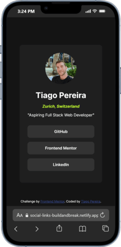
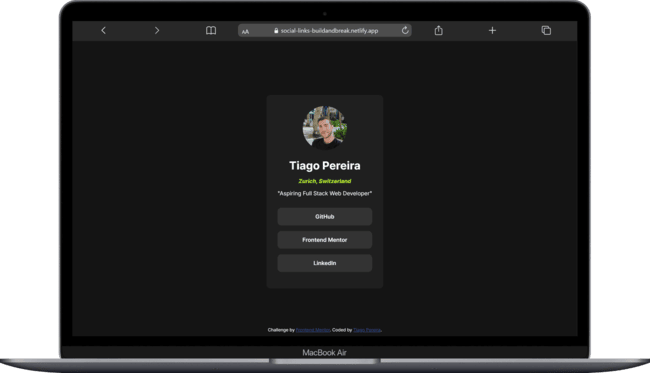

# Social Links Profile | Frontend Mentor

This is my personal profile card, where I present myself as an aspiring Full Stack Web Developer based in Zurich, Switzerland.

It includes my avatar, location, and quick access to my main profiles — GitHub, Frontend Mentor, and LinkedIn.
I focused on creating a clean, centered layout with good contrast, visual hierarchy, and accessibility in mind.

## Table of contents

- [Overview](#overview)
  - [Screenshot](#screenshot)
  - [Links](#links)
- [My process](#my-process)
  - [Built with](#built-with)
  - [What I learned](#what-i-learned)
  - [Continued development](#continued-development)
  - [Useful resources](#useful-resources)
- [Author](#author)
- [Acknowledgments](#acknowledgments)

## Overview

Users should be able to:

- See hover and active states for all interactive elements on the page.
- View the optimal layout depending on their device's screen size.

### Screenshot

**Mobile Version**



**Laptop Version**



### Links

- Solution URL: [Add solution URL here](https://your-solution-url.com)
- Live Site URL: [Add live site URL here](https://your-live-site-url.com)

## My process

### Built with

- Semantic HTML5 markup
- CSS3
- Flexbox
- Mobile-first workflow

### What I learned

This project helped me refine my understanding of flexbox alignment, how to manage spacing within vertical layouts, and how to maintain readability with good color contrast.
I also learned how to design a minimal and visually balanced card while keeping it fully responsive.

Using variables for colors and font weights allowed me to quickly test different themes and improve the maintainability of my stylesheet.

```css
:root {
  --Green: hsl(75, 94%, 57%);

  --White: hsl(0, 0%, 100%);

  --Grey-700: hsl(0, 0%, 20%);
  --Grey-800: hsl(0, 0%, 12%);
  --Grey-900: hsl(0, 0%, 8%);

  --ff-regular: "Inter", sans-serif;
  --fw-400: 400;
  --fw-600: 600;
  --fw-700: 700;
}
```

### Continued development

I want to keep improving my front-end and responsive design skills by completing more complex Frontend Mentor challenges.
My goal is to keep refining my understanding of layout techniques, accessibility, and clean code structure as I move toward full-stack development.

### Useful resources

[Frontend Mentor](https://www.frontendmentor.io/home)
– Always a great place to practice realistic layouts and improve front-end structure.

## Author

- Website - [Tiago Pereira](https://social-links-buildandbreak.netlify.app/)
- Frontend Mentor - [@BuildAndBreak](https://www.frontendmentor.io/profile/BuildAndBreak)
- Linkedin - [Tiago Pereira](https://www.linkedin.com/in/tiago-pereira-5a4698289/)
- Github - [@BuildAndBreak](https://github.com/BuildAndBreak)

## Acknowledgments

Thanks to the Frontend Mentor community for inspiration and feedback.
